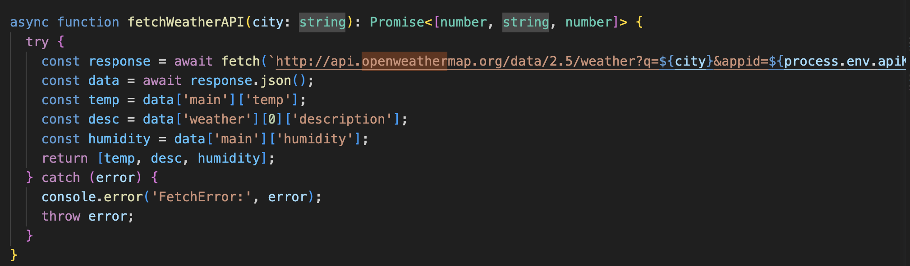
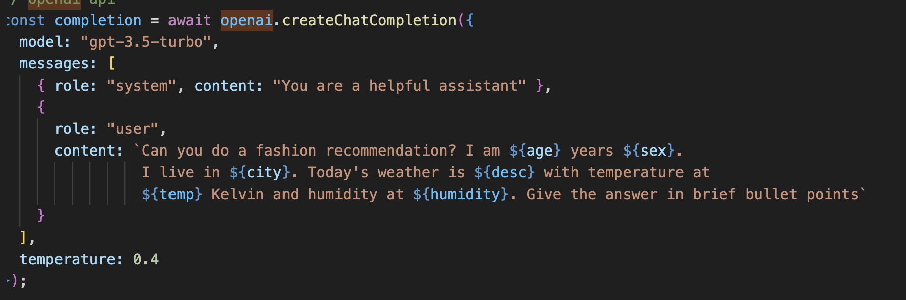
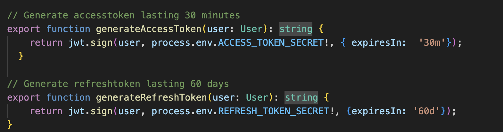
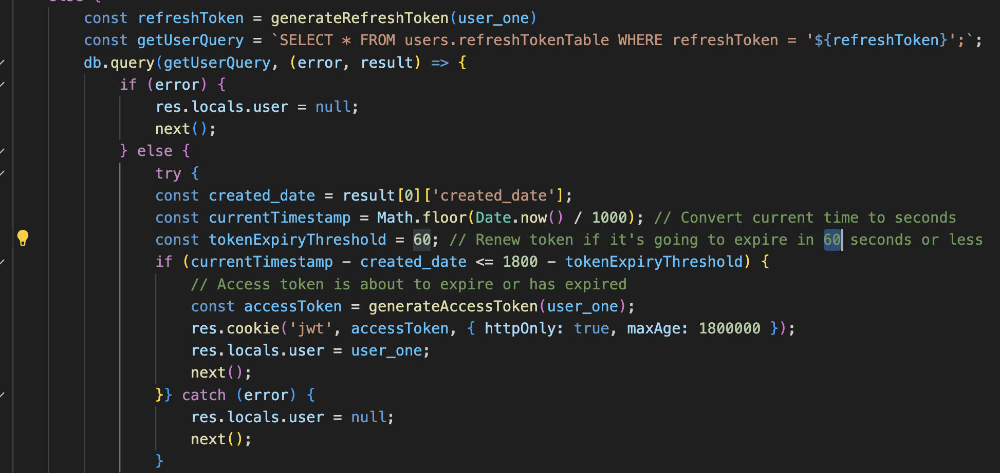
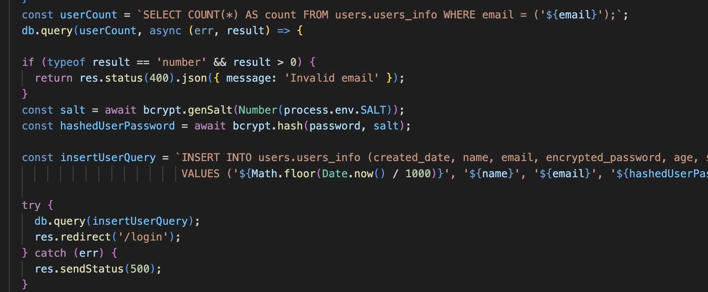
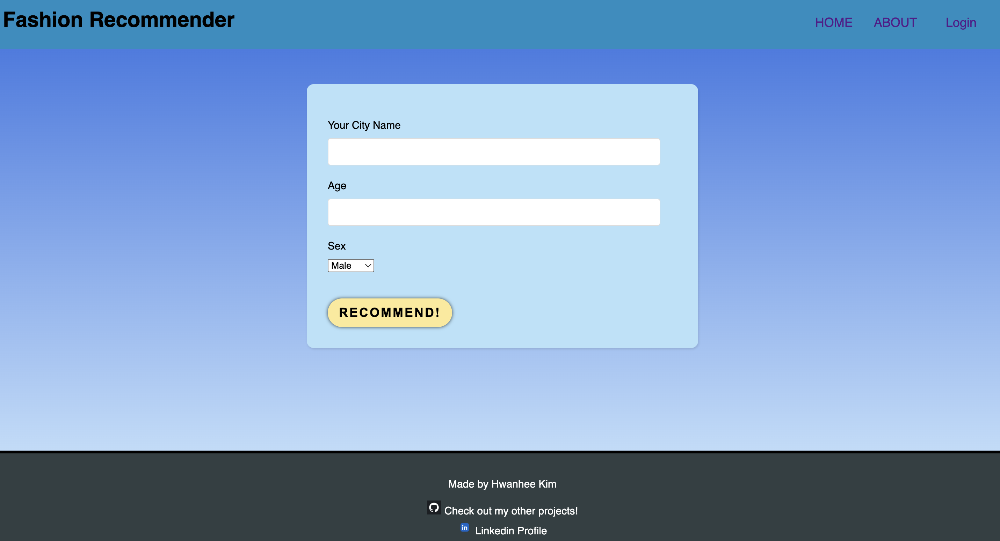
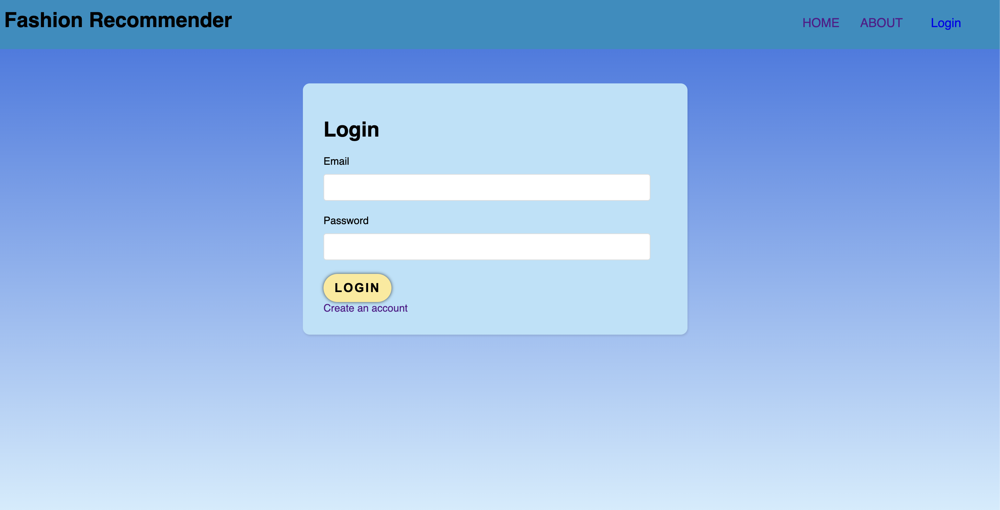
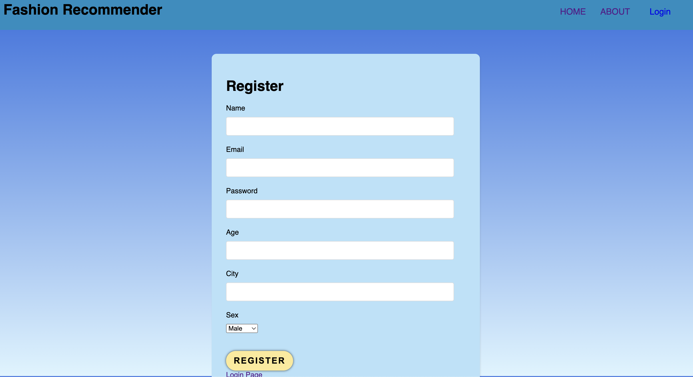
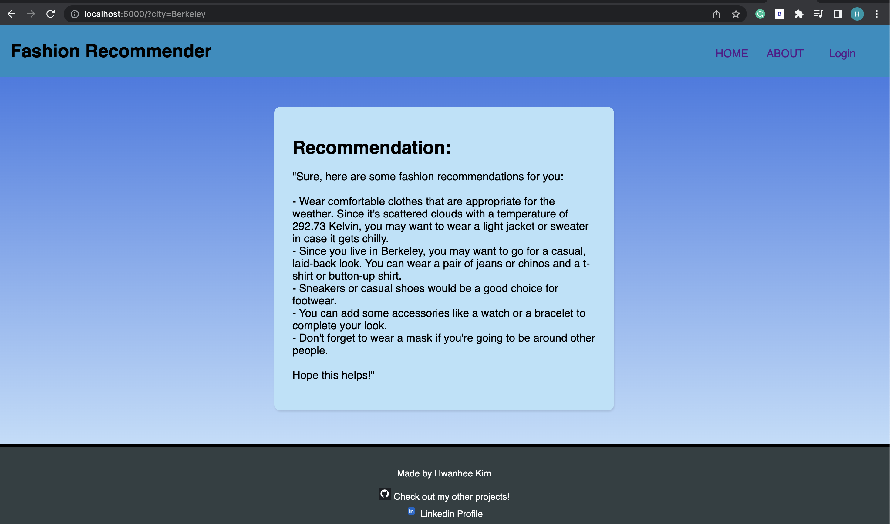

# Real-Time Weather Fashion Recommendation

## Introduction
Welcome to Real-Time Weather Fashion Recommendation, a project designed to revolutionize your fashion choices and help you stay stylish and weather-ready at all times. This application combines real-time weather data with personalized fashion recommendations to provide you with the perfect outfit suggestions based on your location, age, and personal style.

## Table of Contents
- [Introduction](#introduction)
- [How It Works](#how-it-works)
- [Technologies Used](#technologies-used)
- [API Integration](#api-integration)
- [Authentication and Database](#authentication-and-database)
- [Demonstration and Analysis](#demonstration-and-analysis)
- [Conclusion and Future Improvements](#conclusion-and-future-improvements)
- [Contributors](#contributors)

## How It Works
1. Input Your Data: As a user, you can visit the home page and provide your age, city, and gender. Alternatively, you can log in to the website, and the system will automatically render recommendations based on the data you provided during registration.

2. Real-Time Weather Data: The application utilizes the OpenWeatherMap API to retrieve real-time weather information for your location. It fetches data such as temperature, weather description, and humidity to accurately assess the current weather conditions.

3. Fashion Recommendation: After gathering the weather data, the system leverages the OpenAI API to generate personalized fashion recommendations. It combines the user's input data with the weather information to deliver relevant and up-to-date outfit suggestions. The recommendations are designed to match your age, gender, and the specific weather conditions at your location.

## Technologies Used
The project is developed using the following technologies:

- TypeScript: The entire application is written in TypeScript, a statically typed programming language that enhances code quality and maintainability.

- Express.js: The backend of the application is built using Express.js, a flexible and lightweight web framework for Node.js.

- React (Transitioning from Vanilla JS): The frontend of the application is currently built using vanilla JavaScript but will soon transition to React, a popular JavaScript library for building user interfaces.

- MySQL: The database used for storing user information and refresh tokens is MySQL. It provides a reliable and scalable solution for data storage.

- AWS RDS: The application integrates with AWS RDS (Relational Database Service) to store and manage the MySQL database securely.

## API Integration
The Real-Time Weather Fashion Recommendation project integrates two key APIs:

1. OpenWeatherMap API: This API is used to fetch real-time weather data based on the user's location. It provides information such as temperature, weather description, and humidity, which are crucial for generating accurate fashion recommendations.

2. OpenAI API: The OpenAI API is utilized to generate personalized fashion recommendations. By combining the user's input data with the weather information obtained from the OpenWeatherMap API, the system produces brief bullet-point recommendations tailored to the user's age, gender, and current weather conditions.

## Authentication and Database
To ensure security and user authentication, the project implements the following:

- JWT Authentication: JSON Web Token (JWT) authentication is used to authenticate and authorize users. When a user logs in, an access token and a refresh token are generated. The access token is stored as a user's cookie and expires after 30 minutes. The refresh token, stored securely in an AWS RDS database, is used to regenerate access tokens when needed. The refresh tokens are securely stored in an AWS RDS database table named "refreshTokenTable." This approach enhances security and allows for the regeneration of access tokens when needed. Refresh Token, unlike access token, has to be secured because it is used to regenerate access token when access token is about to be expired. The program will leverage refresh token to generate access token and give it to the user as a cookie.

    
    

- User Information Storage: User data, including age, city, gender, user creation date, email, and encrypted password, is stored in a separate table within the MySQL database. The password is encrypted using the bcrypt npm package to enhance security.

## Demonstration and Analysis
- User not logged in: On the home page, the user can enter their city, age, and gender. Upon clicking the "Recommend" button, the system generates fashion recommendations based on the provided information and the current weather conditions.

    
    

- User logged in: When a user is logged in, the home page automatically retrieves their stored information from the AWS RDS database and generates personalized fashion recommendations accordingly.

## Conclusion and Future Improvements
The completion of the Real-Time Weather Fashion Recommendation project was an exciting journey that allowed for advancements in JavaScript/TypeScript knowledge and the exploration of new concepts such as JWT authentication. The project was built based on personal fashion preferences, combining passion and technology.

In the future, the following improvements are planned:

- Enhancing loading efficiency through more efficient data structures and algorithms.
- Transitioning from vanilla JavaScript to React for improved frontend development.
- Deploying the website to the cloud, specifically AWS, to ensure scalability and availability.
- Providing more detailed prompts to obtain more specific and accurate fashion recommendations.

## Contributors
- Hwanhee Kim (voiucee@gmail.com)
